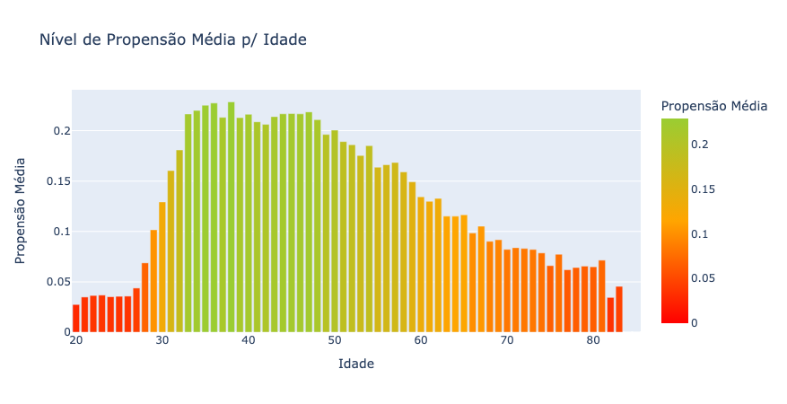

# Saúde ao Alcance: Otimizando Vendas de Planos de Saúde para Clientes de Seguros Automotivos 🏥🚗

Nosso projeto foi além de dados e modelos de previsão. Ele trouxe para a seguradora uma nova forma de conectar clientes automotivos a planos de saúde, usando inteligência de dados para otimizar uma campanha de cross-sell e transformar desafios em oportunidades.

### O Contexto

Imagine uma seguradora com uma carteira repleta de clientes automotivos. Ao lançar uma oferta de planos de saúde para esses clientes, a expectativa era alta. Porém, a taxa de conversão mal chegava a 12,2%. Diante desse cenário, nossa equipe de dados foi acionada: **será que podemos aumentar essa taxa e gerar valor significativo?**

### Explorando o Potencial 🚀

Com uma análise de dados aprofundada, partimos para a compreensão dos padrões de compra. Surpreendentemente, encontramos algumas revelações:
- **Pessoas entre 33 e 48 anos** se destacaram, com uma taxa de conversão acima de 20%, muito superior à média.

- Descobrimos que os **canais de vendas fazem toda a diferença**: os melhores canais conseguiram taxas de 25% a 30% de conversão!
- No entanto, uma **questão crítica de fidelização** chamou nossa atenção: clientes anteriores de seguro de saúde **quase não demonstraram interesse em renovar o plano**. Isso aponta para uma necessidade urgente de entender se o problema é percepção de qualidade ou uma oferta mais competitiva dos concorrentes.

| Anteriormente Segurado | Propensão | Proporção  |
|------------------------|----------|------------|
| Não                    | Negativa      | 0.774546   |
| Não                    | Positiva      | 0.225454   |
| Sim                    | Negativa      | 0.999095   |
| Sim                    | Positiva      | 0.000905   |

### A Resposta Inteligente 💡

Para resolver o problema, utilizamos técnicas avançadas para identificar, entre milhares de clientes, aqueles com maior potencial de conversão. Os resultados foram surpreendentes: Dos 20.000 top clientes do ranking, **16.700 clientes converteram**, capturando assim 83,6% de todos os 60.000 clientes da base de dados. Um verdadeiro impacto que vai além dos números.

### O Impacto em Números 📈

Com base nos valores de prêmio anual, nossa projeção de conversão representa mais **R$ 500 milhões em faturamento**. Não é só sobre a precisão dos dados; é sobre resultados tangíveis que impulsionam o negócio e permitem um retorno muito além das expectativas.

### Para o Futuro

A questão da fidelização do produto exige uma investigação mais profunda, assim recomendamos que o time de suporte realize pesquisas de satisfação com os clientes o mais breve possível. Isso ajudará a identificar as causas dessa falha crítica e a definir estratégias para reforçar a retenção e reduzir o CAC(Custo de Aquisição de Clientes).

Ademais, o projeto não se encerra na análise de dados e na criação de modelos. Ele foi estruturado com uma API flexível que pode ser integrada a sistemas de CRM. 
Assim, as equipes de vendas têm acesso direto às previsões de maior potencial, otimizando seu foco para alcançar resultados ainda mais expressivos. Estamos animados para ver como essa estratégia de vendas vai evoluir e continuar a gerar resultados.

---

Esse projeto é um exemplo claro de como **inteligência de dados** pode transformar uma iniciativa de cross-sell em uma ferramenta poderosa para crescimento e fidelização. Seja bem-vindo a conhecer mais sobre o projeto e como ele pode inspirar o próximo passo para sua empresa!

